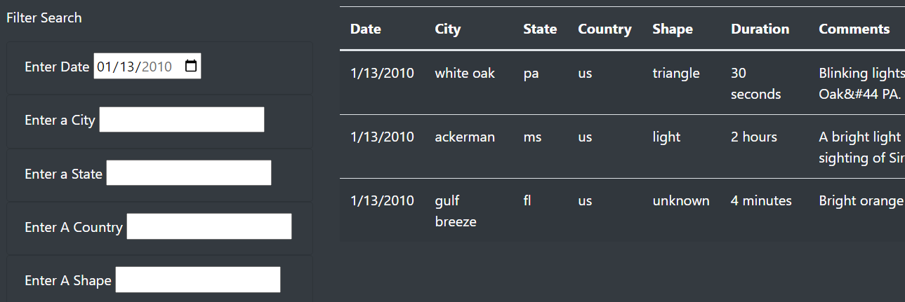
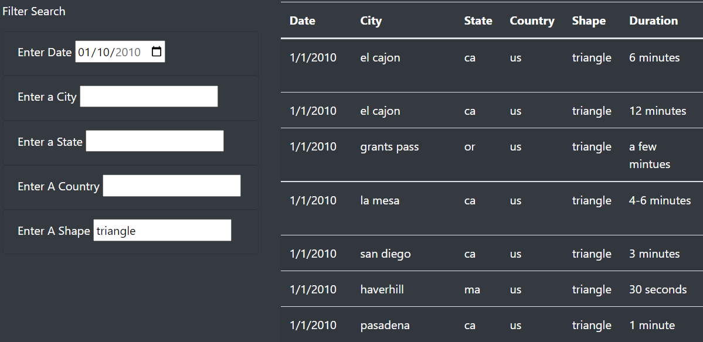

# A written report on the UFO analysis

## Overview of the Upcoming Silver Tsunami Analysis
**The project was created to gather the information from the JS data file, process it, and display the result on the web page.  To do so, we adopted JavaScript (ES6), CSS, and HTML, Gave options to the users to filter the data as they wished.**

## Overview of the analysis:
JavaScript ES6 brings new syntax and features to make code more modern and readable. Using ES was a simple way to retrieve data and put it into the Object.  
ES6 offers many object-related libraries,  such as a filter that can be written with JavaScript events to process the data as the user wanted.  
Although there are various ways to do this, it allowed us to write less code, in a short period.  

## Results:
<b>This is the beginning of the page (process rather).  This page can be linked to other wonderful sites, or scraping the data store it as JS file adds more dynamic functions, 
or even add more complicated data and filter it the way the users can glance at it in a short time. 
Usage of this page is limitless, we can extend the functionalities, we can add more pages, and process many other available data. </b>
	

## Summary:
It was quite a journey adding multiple search filters but capturing it into an Object made things easier.  The difficult part of it was not knowing all the existing functions to come up with the best design.
Once we learn more, we might be able to write clear, condensed, more readable codes.  I was thinking though, we may add text search, using regex or scraping related data, format into the JS file, and access it to give more options to the users to interact with :

## Examples of Search
### Search by Date (First)

### Search by Shape (Last)

